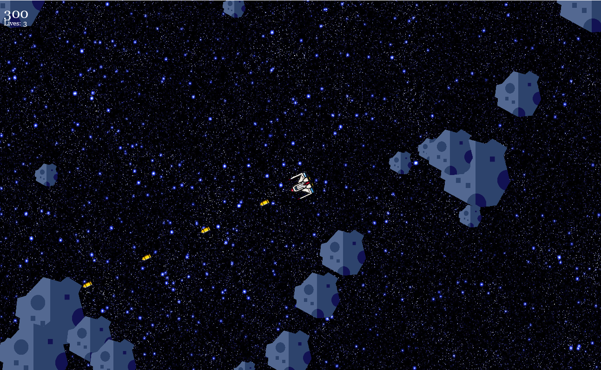

# Asteroids AI with Genetic Algorithm

Hey there! We here implement an AI agent for the ATARI 'Asteroids' game in python using a simple PyTorch Feed-forward Neural Net and a genetic algorithm.

 

### Quick starter

- Clone this repository: $ git clone https://github.com/me-daniel/asteroids.git
- Install required packages: $ pip install -r requirements.txt
- Execute the genetic algorithm: $ python3 genetic_algorithm.py

In the documentation.md you can find an elaborate description of the project's goal, an overview of the project and its customizabilities.
For a singleplayer version of the game, go to https://github.com/flosener/asteroids.
And that's it - have fun watching the agent learn!
