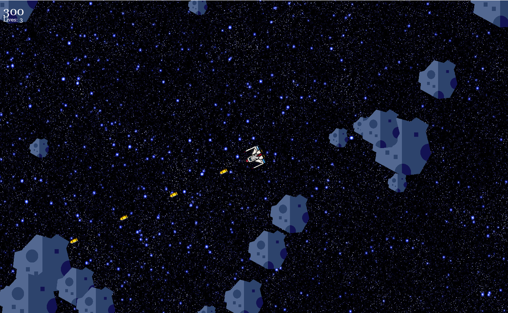

# Asteroids – Programming Journey

## Basic functionality

  
Before we started to write any code we familiarized ourselves with the `pygame library`. We followed a few tutorials found on YouTube and pygame's official website (https://www.pygame.org/wiki/tutorials). After we achieved a basic understanding we started coding.  
First, we constructed the basic board in the main method. Next we chose the images for the background, asteroids, the ship the player will be controlling and for the bullets fired by the ship. As suggested by the tutors, we went with a single image for all asteroids and only varied their appearance in size. Afterwards we went ahead and created the `player` class.  
At this point you can already start up the game and see the ship in the middle of the board, but the move and shoot inputs were still missing. Next we implemented the asteroids, so we created the `enemy` class. For that we had to define spawn points, a direction in which they fly, as well as speed and size of the asteroids. For variability we assigned the size and spawn point of the asteroids randomly. There are four possible spawn points, which are all slightly outside the observable window to avoid the player witnessing their sudden creation. The speed of the asteroids was also chosen randomly from a small window of possible speeds in relation to their size. The movement of the asteroids was implemented by constantly updating their position along a predetermined direction. We added the player score and lives to the displayed information during the game and included a game over screen upon reaching 0 lives.  
Next we implemented player movement and the ability to shoot at the asteroids. Since the pygame library provides some basic input functionalities, it was just a matter of correctly transforming the player's position and rotation. To rotate objects, we defined an angle parameter, that kept track of the direction the object is currently facing. We then used the trigonometric functions sine and cosine to translate the angle into the correct proportions of x- and y-movement. We implemented shooting by instantiating `bullet` objects in front of the player, that travel in a straight line along the direction the player is currently facing.  
As the last and biggest step we created the numerous collision conditions between the different objects and the corresponding procedures that subsequently get initiated. These are:

- Collision of a Bullet with an asteroid
  + Increase player score if it is of the smallest size, else split the asteroid into smaller parts
- Collision of the Player with an asteroid
  + Reduce player's lives and remove asteroid

## Fine tuning
After this the game was running as we intended, so we experimented with our chosen spawn rates, asteroid speeds and decided to include different difficulties. By testing we decided to use a fire rate of three shots per second. Since the hitboxes of our objects are all rectangles, we edited the original ship to look more like a square to make it easier to see whether you would get hit by an approaching asteroid. We also implemented a difficulty setting with three levels, influencing the speed of the asteroids. Furthermore, we tested different settings of the game, e.g. asteroids reentering the field on the opposite side when exiting the displayed window instead of just disappearing. Lastly we further adapted values for speed, size, spawn rates etc. and decided for what we liked best.

## Screenshots  

 

  

Game screen during playing

 
 

  

Gameover screen after dying

