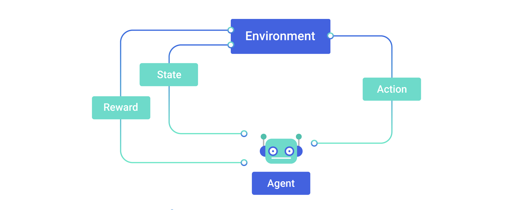
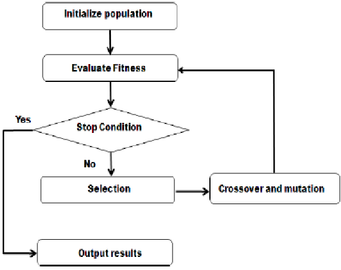
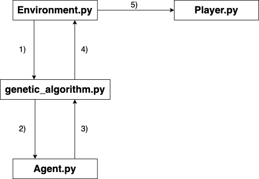

# AsteroidsAI - Documentation

## Background

 
Reinforcement learning is an area of machine learning where an agent observes its state in the environment and acts upon it to receive rewards and consequently, to learn.

[comment]: <> https://perfectial.com/wp-content/uploads/2018/07/img2-7.jpg

In this implementation we use a Feed-forward neural network (FFNN) together with a genetic algorithm (GA) to train an agent to play the 'ATARI' arcade game asteroids. The genetic algorithm belong to the class of evolutionary algorithms and is inspired by natural selection. It thereby relies on biologically inspired operators like selection, crossover and mutation. The algorithm works as follows:
- 0) Initialize a random population
- 1) Evaluate its fitness
- 2) Based on the agents' fitness, select parents to consequently create a next population
- 3) Use biologically inspired operators like crossover and mutation on the new population
- 4) Return to step 1
This process is repeated until a stop condition is met, e.g. the agent successfully learned to achieve its goal and reach a high fitness value.

[comment]: <> https://www.researchgate.net/profile/Ahmadi-Abdeslam/publication/263224226/figure/fig2/AS:296412404305926@1447681632206/Genetic-algorithm-flowchart.png

## Project flow

 
The inputs and outputs of the single scripts flow as follows:
- 0) Initially, a population with a certain amount of agents is instantiated. The agents' brains are initialized with random weights.
- 1) In the environment, observations of the agent are collected and sent to the main() function (the genetic algorithm).
- 2) Observations are sent to the agent's brain, which performs a forward pass in a feed-forward neural network.
- 3) The output of the FFNN are the actions to be performed by the agent. They are sent to the GA.
- 4) The received actions are performed in the agents' respective environments.
- 5) The spaceship player object (rotation, thrust and shooting) is updated accordingly.
After a given number of generations is done with training, the average performance of the AI across all generations is plotted.
 
The fitness is the survival time of each agent. The selection of the parents for the next population takes place as fitness proportinate roulette wheel selection. Crossover is done by using each gene (NN weight) by either parent to 50% for the new child. Finally, each gene of a new child has 90% probability of being mutated by adding/subtracting 10-50% of its original value.

## Hyperparameters

 
In the helper.py script you can find adjustable hyperparameters for the genetic training loop as well as the FFNN, like number of neurons in the net, number of training generations (epochs) or number of agents per population.

